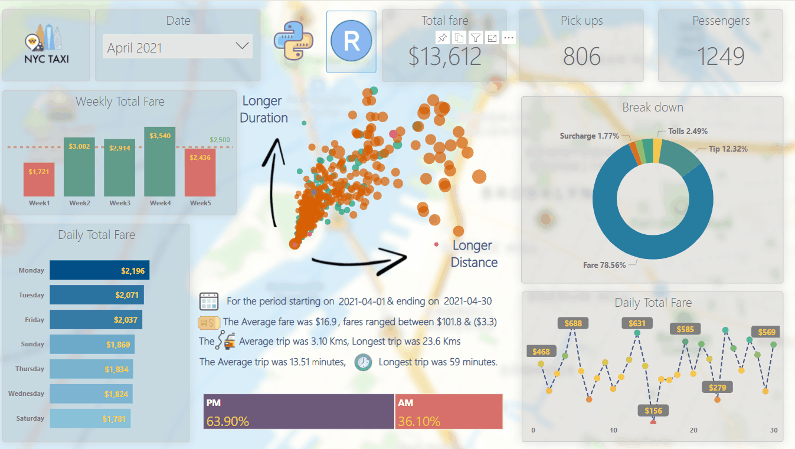
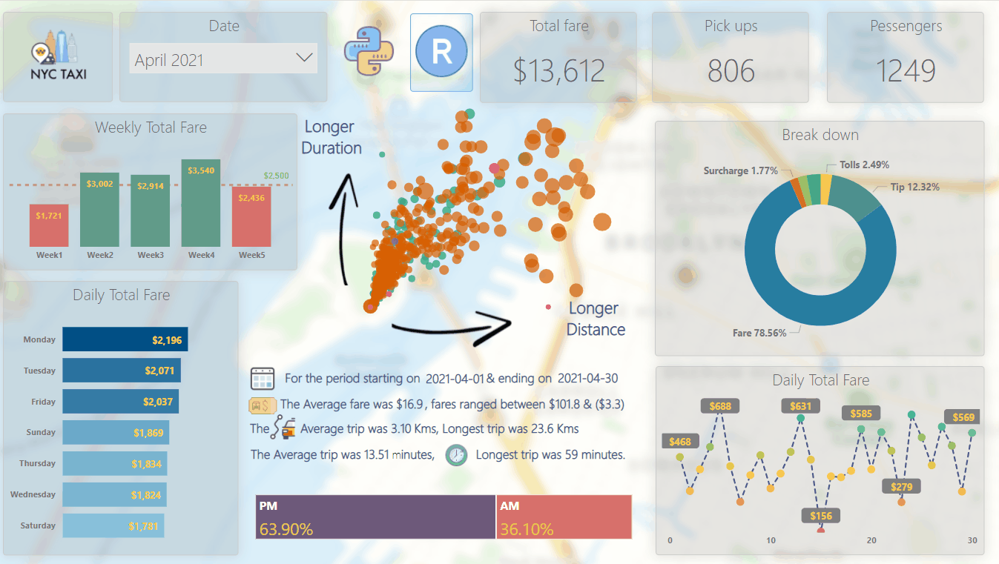
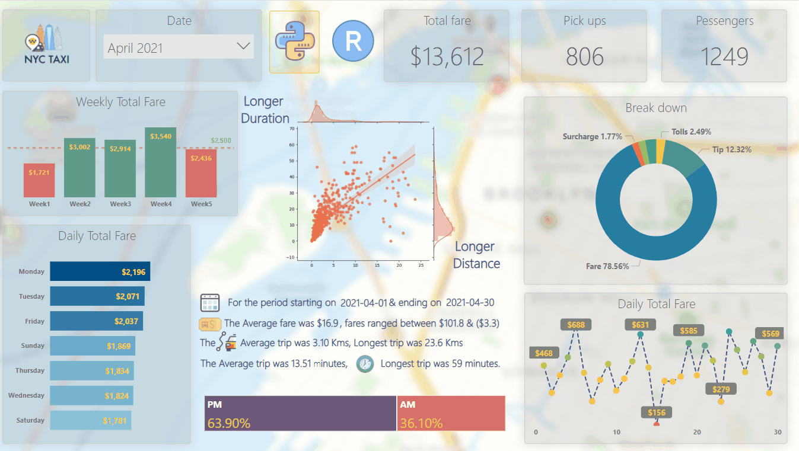

# Data Visualization with PowerBI Course & Dashboard

### This dashboard is intended for educational puposes & preparing Data analysts for Exam DA-100: Analyzing Data with Microsoft Power BI      

* [Course](https://bookdown.org/moh_aymang/data_visualization_powerbi/)

* [Data Catalog](data/data_dictionary_trip_records_yellow.pdf)

## R interactive Costum visual 

## Filtering 

