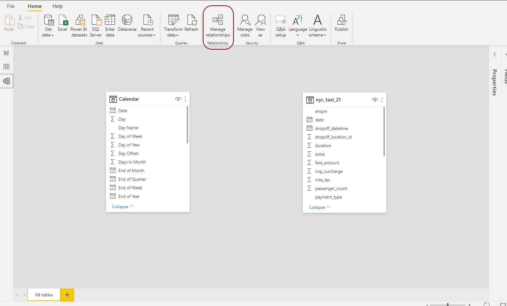
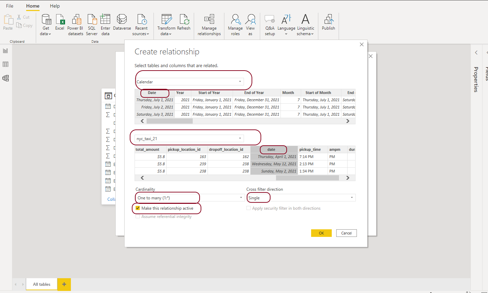

# DataModel
_Data Modeling_ in PowerBI vocabulary is: the step of creating relations between tables before proceeding and building slicers and filters on our visuals we need to make sure that the relationships are with the right direction, cardinality and that they are active. 

**We will create 1 relation between Calendar table and the data table**

## Step 1 

Navigate to data modeling view

## Step 2  

Click on manage relations

## Step 3  

Create new relation and make sure of the following:    

* Select the right tables     
* Select the right columns (by clicking on the column name in the display)      
* Select the right Cardinality (usually with Calendar tables its One to many)       
* Select the right direction (**Calendar** table to filter **nyc_tax_21** table)      

