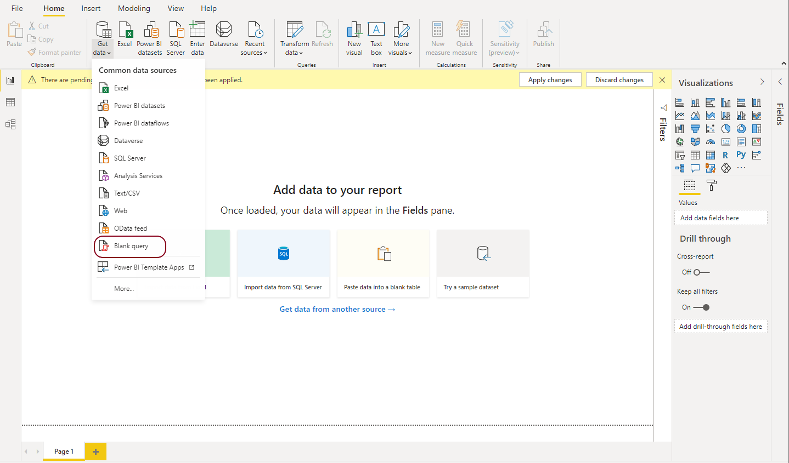

# Dataset

_Dataset_ in PowerBI vocabulary is: the set of queries that the user will perform in order to import all of his data tables and all the transformations that will take place before data can be ready for the model and visualization.

**We will perform 2 queries to create 2 data tables:**

+ Table 1 (**nyc_taxi_21**) : will include NYC TLC data. <https://github.com/Mkassem16/NycTaxiPBI/blob/main/queries/nyc_taxi_21.pq>
+ Table 2 (**Calendar**) : Calendar table that will control the date dimension
<https://github.com/Mkassem16/NycTaxiPBI/blob/main/queries/Calendar.pq>

## Step 1 

Getting data through Blank query

## Step 2 

Choose Advanced editor

## Step 3 

Get the query of Table 1 from the provided link and paste it here instead of 
what is already there

## Step 4    

Make sure that query name is **nyc_taxi_21**

## Step 5 

Get the query of Table 2 from the provided link and paste it here instead of 
what is already there

## Step 6 

Make sure that query name is **Calendar**

## Step 7  

Double check queries names as its important for Measures created through DAX,
Then click close & apply

